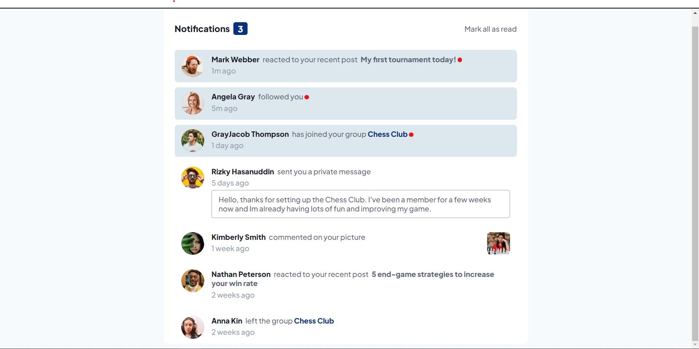

# Frontend Mentor - Notifications page solution

This is a solution to the [Notifications page challenge on Frontend Mentor](https://www.frontendmentor.io/challenges/notifications-page-DqK5QAmKbC). Frontend Mentor challenges help you improve your coding skills by building realistic projects.

## Table of contents

- [Overview](#overview)
  - [The challenge](#the-challenge)
  - [Screenshot](#screenshot)
  - [Links](#links)
- [My process](#my-process)
  - [Built with](#built-with)
  - [Continued development](#continued-development)

- [Author](#author)

## Overview

### The challenge

Users should be able to:

- Distinguish between "unread" and "read" notifications
- Select "Mark all as read" to toggle the visual state of the unread notifications and set the number of unread messages to zero
- View the optimal layout for the interface depending on their device's screen size
- See hover and focus states for all interactive elements on the page

### Screenshot

### Links

- Solution URL: [Add solution URL here](https://github.com/Iyanu1396/notifications-page-main.git)
- Live Site URL: [Add live site URL here](https://iyanus-notifications-page.netlify.app/)

## My process

just basic dom manipulation , i create the data i need in the data.js file then i rendered it on the ui based on the results i wanted to achieve

### Built with

-Javascript

- Semantic HTML5 markup
- Vanila CSS
- Flexbox
- Mobile-first workflow

### Continued development

more DOM manipulation practices......

## Author

- Website - [Iyanu Codes](https://github.com/Iyanu1396)
- Frontend Mentor - [@Iyanu1396](https://www.frontendmentor.io/profile/Iyanu1396)
- Twitter - [@iyanu_codes](https://twitter.com/iyanu_codes)
